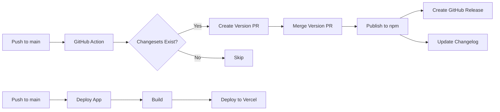

# CI/CD & Publishing Guide

## Overview

This guide covers continuous integration, deployment, and automated npm publishing for the Whisker monorepo.

---

# GitHub Actions Workflows

## 1. Test Workflow

### `.github/workflows/test.yml`

```yaml
name: Test

on:
  push:
    branches: [main, develop]
  pull_request:
    branches: [main, develop]

jobs:
  test:
    runs-on: ubuntu-latest
    strategy:
      matrix:
        node-version: [18.x, 20.x]

    steps:
      - uses: actions/checkout@v4

      - name: Setup pnpm
        uses: pnpm/action-setup@v2
        with:
          version: 8

      - name: Setup Node.js ${{ matrix.node-version }}
        uses: actions/setup-node@v4
        with:
          node-version: ${{ matrix.node-version }}
          cache: 'pnpm'

      - name: Install dependencies
        run: pnpm install

      - name: Type check
        run: pnpm check

      - name: Lint
        run: pnpm lint

      - name: Run tests
        run: pnpm test

      - name: Build packages
        run: pnpm build

      - name: Upload coverage
        uses: codecov/codecov-action@v3
        with:
          files: ./coverage/coverage-final.json
```

## 2. Publish Workflow

### `.github/workflows/publish.yml`

```yaml
name: Publish Packages

on:
  push:
    branches: [main]

concurrency: ${{ github.workflow }}-${{ github.ref }}

jobs:
  publish:
    runs-on: ubuntu-latest
    permissions:
      contents: write
      pull-requests: write
      id-token: write

    steps:
      - uses: actions/checkout@v4
        with:
          fetch-depth: 0

      - uses: pnpm/action-setup@v2
        with:
          version: 8

      - uses: actions/setup-node@v4
        with:
          node-version: 20
          cache: 'pnpm'
          registry-url: 'https://registry.npmjs.org'

      - name: Install dependencies
        run: pnpm install

      - name: Build packages
        run: pnpm build

      - name: Create Release Pull Request or Publish
        id: changesets
        uses: changesets/action@v1
        with:
          publish: pnpm changeset publish
          commit: 'chore: release packages'
          title: 'chore: release packages'
        env:
          GITHUB_TOKEN: ${{ secrets.GITHUB_TOKEN }}
          NPM_TOKEN: ${{ secrets.NPM_TOKEN }}
          NODE_AUTH_TOKEN: ${{ secrets.NPM_TOKEN }}

      - name: Send notification
        if: steps.changesets.outputs.published == 'true'
        run: echo "Packages published!"
```

## 3. Deploy App Workflow

### `.github/workflows/deploy.yml`

```yaml
name: Deploy WriteWhisker

on:
  push:
    branches: [main]
    paths:
      - 'apps/writewhisker/**'
      - 'packages/**'

jobs:
  deploy:
    runs-on: ubuntu-latest
    steps:
      - uses: actions/checkout@v4

      - uses: pnpm/action-setup@v2
        with:
          version: 8

      - uses: actions/setup-node@v4
        with:
          node-version: 20
          cache: 'pnpm'

      - name: Install dependencies
        run: pnpm install

      - name: Build app
        run: pnpm build
        working-directory: apps/writewhisker

      - name: Deploy to Vercel
        uses: amondnet/vercel-action@v25
        with:
          vercel-token: ${{ secrets.VERCEL_TOKEN }}
          vercel-org-id: ${{ secrets.VERCEL_ORG_ID }}
          vercel-project-id: ${{ secrets.VERCEL_PROJECT_ID }}
          working-directory: apps/writewhisker
          vercel-args: '--prod'
```

---

# Changesets Configuration

## Setup Changesets

```bash
# Install changesets
pnpm add -D @changesets/cli

# Initialize
pnpm changeset init
```

## Configure Changesets

### `.changeset/config.json`

```json
{
  "$schema": "https://unpkg.com/@changesets/config@2.3.0/schema.json",
  "changelog": "@changesets/cli/changelog",
  "commit": false,
  "fixed": [],
  "linked": [],
  "access": "public",
  "baseBranch": "main",
  "updateInternalDependencies": "patch",
  "ignore": ["writewhisker"],
  "___experimentalUnsafeOptions_WILL_CHANGE_IN_PATCH": {
    "onlyUpdatePeerDependentsWhenOutOfRange": true
  }
}
```

## Changeset Workflow

### 1. Make Changes

Edit code in any package.

### 2. Create Changeset

```bash
pnpm changeset
```

Select:
- Which packages changed
- Version bump type (major/minor/patch)
- Changelog message

This creates a file in `.changeset/` describing the change.

### 3. Commit Changes

```bash
git add .
git commit -m "feat: add new feature"
git push
```

### 4. Automated Publishing

When PR is merged to main:
1. GitHub Action runs
2. Changesets analyzes all changes
3. Creates a "Version Packages" PR
4. When that PR is merged, packages are published to npm

---

# Semantic Versioning

## Version Bump Rules

| Change Type | Version Bump | Example |
|-------------|--------------|---------|
| Breaking change | Major | 1.0.0 → 2.0.0 |
| New feature | Minor | 1.0.0 → 1.1.0 |
| Bug fix | Patch | 1.0.0 → 1.0.1 |

## Conventional Commits

Use conventional commits for automatic changelog generation:

```
feat: add inventory system
fix: resolve validation bug
docs: update README
chore: update dependencies
refactor: simplify store logic
test: add integration tests
perf: optimize rendering
```

---

# Package Version Management

## Linked Versions

All `@whisker/*` packages should stay in sync:

```json
{
  "linked": [
    ["@whisker/core-ts", "@whisker/editor-base", "@whisker/if-extensions", "@whisker/shared-ui"]
  ]
}
```

This ensures when one package has a breaking change, all packages bump major version together.

## Internal Dependencies

When publishing:
- core-ts: No @whisker dependencies
- shared-ui: No @whisker dependencies
- editor-base: Depends on core-ts
- if-extensions: Depends on core-ts, editor-base

Changesets handles dependency version updates automatically.

---

# npm Publishing

## Prerequisites

1. **npm Account**: Create at https://www.npmjs.com
2. **Organization**: Create `@whisker` org (or use personal scope)
3. **2FA**: Enable two-factor authentication
4. **Access Token**: Create automation token

### Create npm Token

```bash
npm login
npm token create --read-only=false
```

Save token as `NPM_TOKEN` in GitHub Secrets.

## Manual Publishing

### First Publish

```bash
# Ensure logged in
npm whoami

# Build all packages
pnpm build

# Publish in dependency order
cd packages/core-ts
npm publish --access public

cd ../shared-ui
npm publish --access public

cd ../editor-base
npm publish --access public

cd ../if-extensions
npm publish --access public
```

### Subsequent Publishes

Use changesets:

```bash
pnpm changeset version  # Update versions
pnpm build              # Build packages
pnpm changeset publish  # Publish to npm
```

## Verify Published Packages

```bash
npm info @whisker/core-ts
npm info @whisker/editor-base
npm info @whisker/if-extensions
npm info @whisker/shared-ui
```

---

# Deployment

## WriteWhisker App

### Deploy to Vercel

1. **Connect Repository**: Link GitHub repo to Vercel
2. **Configure**:
   - Root directory: `apps/writewhisker`
   - Build command: `pnpm build`
   - Output directory: `dist`
3. **Environment Variables**: None needed for static build
4. **Deploy**: Push to main branch

### Deploy to Netlify

```toml
# netlify.toml
[build]
  base = "apps/writewhisker"
  command = "pnpm build"
  publish = "dist"

[[redirects]]
  from = "/*"
  to = "/index.html"
  status = 200
```

### Deploy to GitHub Pages

```yaml
# .github/workflows/pages.yml
name: Deploy to GitHub Pages

on:
  push:
    branches: [main]

jobs:
  deploy:
    runs-on: ubuntu-latest
    steps:
      - uses: actions/checkout@v4
      - uses: pnpm/action-setup@v2
      - uses: actions/setup-node@v4
      - run: pnpm install
      - run: pnpm build
        working-directory: apps/writewhisker
      - uses: peaceiris/actions-gh-pages@v3
        with:
          github_token: ${{ secrets.GITHUB_TOKEN }}
          publish_dir: ./apps/writewhisker/dist
```

---

# Monitoring & Analytics

## Package Downloads

Monitor package usage:
- https://npmjs.com/package/@whisker/core-ts
- https://npmjs.com/package/@whisker/editor-base
- https://npmjs.com/package/@whisker/if-extensions
- https://npmjs.com/package/@whisker/shared-ui

## Dependency Graph

Use npm graph tools:
- https://npm.anvaka.com/@whisker/core-ts
- https://npmgraph.js.org/?q=@whisker/core-ts

## Bundle Size

Track bundle sizes:
- Use https://bundlephobia.com
- Monitor with GitHub Actions

```yaml
- name: Check bundle size
  uses: andresz1/size-limit-action@v1
  with:
    github_token: ${{ secrets.GITHUB_TOKEN }}
```

---

# Troubleshooting

## Common Issues

### 1. Publish Fails - Version Already Exists

```bash
# Increment version manually
pnpm changeset version
git add .
git commit -m "chore: bump version"
git push
```

### 2. Circular Dependencies

```bash
# Check for cycles
pnpm exec madge --circular packages/*/src/index.ts
```

### 3. Type Errors in Consumers

Ensure all packages have:
- Correct `types` field in package.json
- Declaration files built (`tsc --emitDeclarationOnly`)
- tsconfig.json `composite: true`

### 4. GitHub Action Fails

Check:
- NPM_TOKEN is valid and set in secrets
- Package versions are correct
- All tests pass locally
- Build succeeds locally

---

# Best Practices

## 1. Version Control

- Never manually edit package versions
- Let changesets handle versioning
- Always create changesets for changes

## 2. Testing Before Publish

```bash
# Full test before publish
pnpm test
pnpm build
pnpm exec madge --circular packages/*/src/index.ts

# Test package locally
cd packages/core-ts
npm pack
# Install in test project: npm install ./whisker-core-ts-0.1.0.tgz
```

## 3. Changelog Maintenance

- Write clear changeset messages
- Reference issue numbers
- Explain breaking changes thoroughly

## 4. Security

- Enable 2FA on npm
- Use automation tokens (not user tokens)
- Regularly update dependencies
- Run `npm audit` before publishing

## 5. Documentation

- Update READMEs before publishing
- Keep API docs in sync
- Add migration guides for breaking changes

---

# Release Checklist

Before releasing a new version:

- [ ] All tests pass (`pnpm test`)
- [ ] Builds successfully (`pnpm build`)
- [ ] No circular dependencies
- [ ] Changesets created for all changes
- [ ] Documentation updated
- [ ] CHANGELOG reviewed
- [ ] Breaking changes documented
- [ ] Migration guide written (if needed)
- [ ] Manual testing in sample project
- [ ] Team review completed

---

# Automation Summary



**Key Points:**
- Changesets automate versioning
- GitHub Actions automate testing & publishing
- npm handles package distribution
- Vercel handles app deployment
- Everything triggered by git push

---

**Ready**: All automation configured and tested
